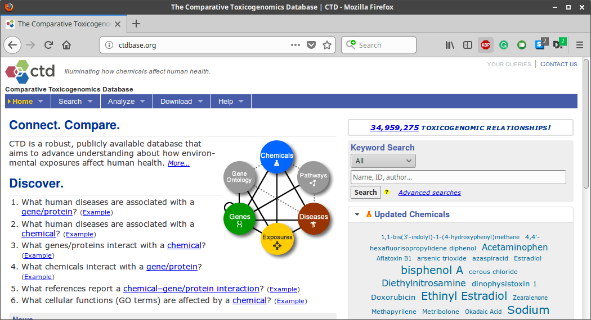
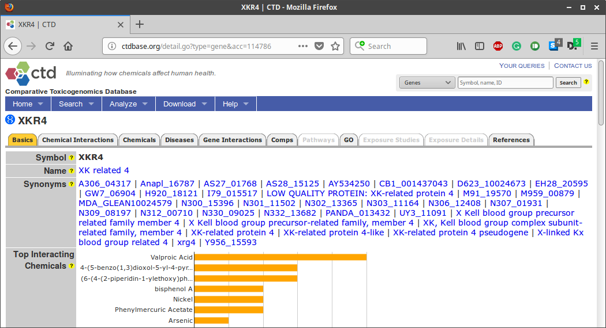
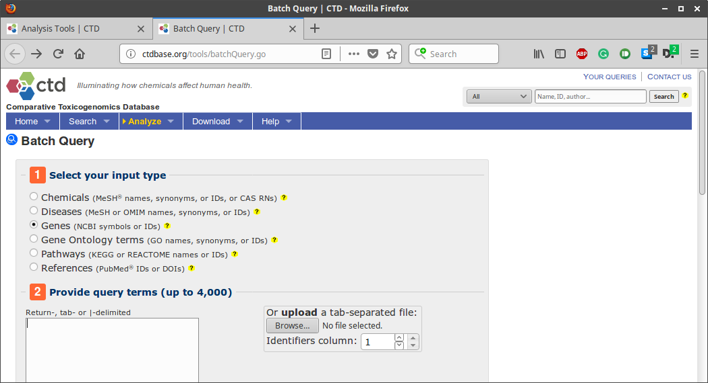

```{r setup, include=FALSE}
knitr::opts_chunk$set(echo = TRUE)
```

# Introduction

## The Comparative Toxicogenomics Database

The Comparative Toxicogenomics Database (*CTDbase*; http://ctdbase.org) is a public resource for toxicogenomic information manually curated from the peer-reviewed scientific literature, providing key information about the interactions of environmental chemicals with gene products and their effect on human disease [@CTDbase2003][@CTDbase2017]. 

## `CTDquerier` R package

`CTDquerier` is an R package that allows to R users to download basic data from *CTDbase* about genes, chemicals and diseases. Once the user's input is validated allows to query *CTDbase* to download the information of the given input from the other modules.


# Quering The Comparative Toxicogenomics Database

*CTDbase* offers a public web-based interface that includes basic and advanced query options to access data for sequences, references, and toxic agents, and a platform for analysis sequences.

## Keyword Search

In order to query *CTDbase* with a single term (aka. a gene, a chemical or a diseases) users can access to the web portal and use the *keyword search*.



Looking for the associations in *CTDbase* for the following set of then genes of interest implies to perform ten queries using this interface.

Follows the summary page of the results obtained after searching for the term *XKR4*:



## Batch Query

The **Batch Query** tool (http://ctdbase.org/tools/batchQuery.go) is a provided by *CTDbase* and allows to download custom data associated with a set of chemicals, diseases and genes amount others.



Given a set of terms the tool allows to download (as `.tsv`, `.xml`, ...) curated or inferred data from *CTDbase* associated to the terms of interest. Table \@ref(tab:BatchQuery-data) indicates the type of available data depending on input terms, being `C` curated, `I` inferred, `E` enriched and `A` all.

| Data Available/Input Data| Chemicals | Diseases | Genes |
|:-------------------------|:---------:|:--------:|:-----:|
|Chemical–gene interactions| C         |          | C     |
|Chemical associations     |           | A,C,I    | C     |
|Gene associations         | C         | A,C,I    | C     |
|Disease associations      | A,C,I     |          | A,C,I |
|Pathway associations      | I,E       | I        | C     |
|Gene Ontology associations| A,E       |          | A     |

: (\#tab:BatchQuery-data) Type of available data in Batch Query depending on type of input terms.

The resulting tables obtained from querying *CTDbase* using the **Batch Query** tool with the gene *XKR4* and asking for associated chemicals and associated diseases (curated, inferred and all) are included in `CTDquerier` R package (queries performed 2018/JAN/02).

These four files can be loaded as follows:

```{r loading_xkr4_tables, warning=FALSE}
# Chemicals - XKR4
bq_xkr4_c <- system.file(
  paste0( "extdata", .Platform$file.sep, "bq_xkr4_chem.tsv" ), 
  package="CTDquerier"
)
nrow( read.delim( bq_xkr4_c, sep = "\t" ) )
# Diseses curated - XKR4
bq_xkr4_dC <- system.file(
  paste0( "extdata", .Platform$file.sep, "bq_xkr4_disease_curated.tsv" ), 
  package="CTDquerier"
)
nrow( read.delim( bq_xkr4_dC, sep = "\t" ) )
# Diseases inferred - XKR4
bq_xkr4_dI <- system.file(
  paste0( "extdata", .Platform$file.sep, "bq_xkr4_disease_inferred.tsv" ), 
  package="CTDquerier"
)
nrow( read.delim( bq_xkr4_dI, sep = "\t" ) )
# Diseases all - XKR4
bq_xkr4_dA <- system.file(
  paste0( "extdata", .Platform$file.sep, "bq_xkr4_disease_all.tsv" ), 
  package="CTDquerier"
)
nrow( read.delim( bq_xkr4_dA, sep = "\t" ) )
```

What we can see from these files is that *XKR4* has, according to *CTDbase*, 18 curated associations with chemicals, 1 curated association with diseases, 1339 inferred associations with diseases and 1340 association with diseases (including both curated and inferred). It must be said that these associations are not unique.

## `CTDquerier`

The `CTDquerier` allows to download the associated information to a single or a set of genes by ysing the function `query_ctd_gene`:

```{r ctdquerier_xkr4}
library( CTDquerier )
xkr4 <- query_ctd_gene( terms = "XKR4", verbose = TRUE )
xkr4
```


The query indicates that 25 gene-chemical interactions were downloaded from *CTDbase*. Takeing a close look to them we see that they corrsponds to the 18 chemicals obtained from **Batch Query** tool.

```{r compare_xkr4_chemicals}
# How many unique chemicals associations there are in the result object?
xkr4_chem <- get_table( xkr4, index_name = "chemical interactions" )
length( unique( xkr4_chem$Chemical.Name ) )

# How many of the chemicals download using CTDquerier are in the Batch Query files?
bq_xkr4_c <- read.delim( bq_xkr4_c, sep = "\t" )
sum( as.character( bq_xkr4_c[ , 2] ) %in% unique( xkr4_chem$Chemical.Name ) )
```

On the side of disease associations, the retrieved data for *XKR4* with `CTDqurier` indicates that there are 762 gene-disease associations.

```{r}
dim( get_table( xkr4, index_name = "diseases" ) )
```

These 762 gene-disease assocations corresponds to the 1340 obtained from **Batch Query** one filtered by unique disease:

```{r}
bq_xkr4_dA <- read.delim( bq_xkr4_dA, sep = "\t" )
length( unique( bq_xkr4_dA$DiseaseID ) )

sum( as.character( unique( bq_xkr4_dA$DiseaseID ) ) %in% 
    get_table( xkr4, index_name = "diseases" )$Disease.ID )
```

The diference in terms of numbers of associations between the results obtained from **Batch Query** and from `CTDquerier` corresponds to the way the chemicals are nested in both tables. While in the results from **Batch Query** there is a row for each associations:

```{r}
bq_xkr4_dA[1:3, ]
```

In the results from `CTDquerier` there is a single entry for the disease instead one for each disease-chemical we see in the previous table from **Batch Query**. This is seen since in the results from `CTDquerier` there is a single entry for *Abdominal Pain* and has the three chemicals in a single `string` into the column `Inference.Network`:

```{r}
tbl <- get_table( xkr4, index_name = "diseases" )
tbl[ tbl$Disease.ID == "MESH:D015746", "Inference.Network" ]
```

# Session Info.

```{r sessionInfo, echo=FALSE}
sessionInfo()
```

# Bibliography
